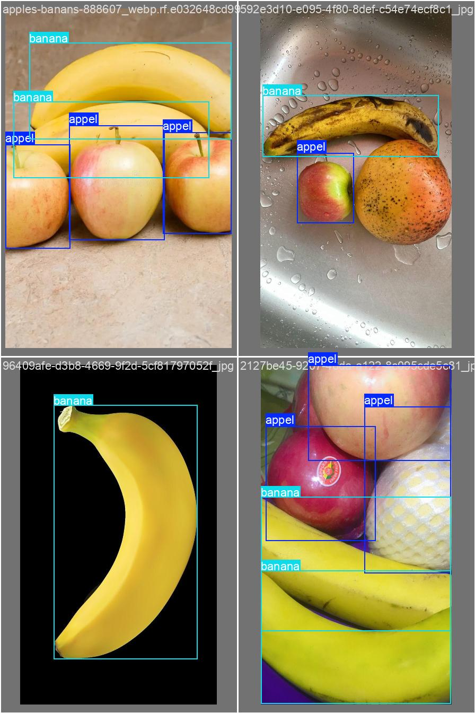
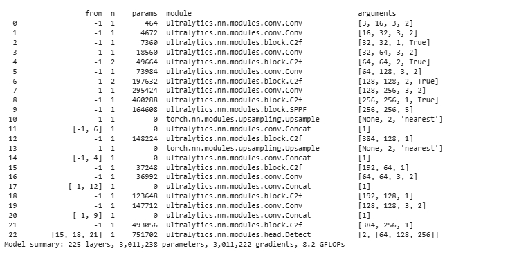

🌱 YOLOv8 Object Detection - Data Labeling Portfolio🌱

Ini adalah proyek portofolio data labeling dan pelatihan model YOLOv8 yang saya kerjakan menggunakan dataset custom untuk mendeteksi objek **Pisang** dan **Apel**.

Proyek ini mencakup proses:
- Data labeling (annotasi bounding box)
- Setup konfigurasi YOLOv8
- Training dan validasi model
- Inference untuk menguji model

---

📁 Struktur Folder 

yolov8-labeling-project/

├── [📄 Lihat file data.yaml](data/data.yaml)

├── 📂 [Buka folder `train`](./train/) # Data training

├── 📂 [Buka folder `valid`](./valid/) # Data validasi

├── 📂 [Buka folder `test`](./test/) # Data pengujian

├── README.md # Dokumentasi proyek

├── [📄 Lihat file best(2).pt](./data/best(2).pt) # Model hasil training

├── [📄 Lihat file results.md](./data/results.md)  # Catatan hasil training/inference

---

## 📦 Dataset

Dataset dibuat dan dilabeli secara manual menggunakan Roboflow, lalu diekspor dalam format YOLOv8. Label terdiri dari beberapa kelas objek relevan dengan kasus nyata.

- Jumlah gambar train: **70**
- Jumlah gambar valid: **20**
- Jumlah kelas: **(otomatis terdeteksi dari `data.yaml`)**

---

> ⚠️ Gambar & label hanya digunakan untuk keperluan edukasi dan demonstrasi portofolio.

---

## ⚙️ Model Training

Model dilatih menggunakan YOLOv8 dari library `ultralytics`.

- Training dilakukan di Google Colab 
- Hasil disimpan di: `yolov8-training/best.pt`

---

## 🔍 Inference & Evaluasi

Downloading https://github.com/ultralytics/assets/releases/download/v8.2.0/yolov8n.pt to 'yolov8n.pt'...
100% 6.25M/6.25M [00:00<00:00, 319MB/s]
New https://pypi.org/project/ultralytics/8.3.156 available 😃 Update with 'pip install -U ultralytics'
Ultralytics YOLOv8.2.103 🚀 Python-3.11.13 torch-2.6.0+cu124 CUDA:0 (Tesla T4, 15095MiB)
engine/trainer: task=detect, mode=train, model=yolov8n.pt, data=/content/banana-apple-1/data.yaml, epochs=20, time=None, patience=100, batch=8, imgsz=640, save=True, save_period=-1, cache=False, device=None, workers=8, project=None, name=train, exist_ok=False, pretrained=True, optimizer=auto, verbose=True, seed=0, deterministic=True, single_cls=False, rect=False, cos_lr=False, close_mosaic=10, resume=False, amp=True, fraction=1.0, profile=False, freeze=None, multi_scale=False, overlap_mask=True, mask_ratio=4, dropout=0.0, val=True, split=val, save_json=False, save_hybrid=False, conf=None, iou=0.7, max_det=300, half=False, dnn=False, plots=True, source=None, vid_stride=1, stream_buffer=False, visualize=False, augment=False, agnostic_nms=False, classes=None, retina_masks=False, embed=None, show=False, save_frames=False, save_txt=False, save_conf=False, save_crop=False, show_labels=True, show_conf=True, show_boxes=True, line_width=None, format=torchscript, keras=False, optimize=False, int8=False, dynamic=False, simplify=True, opset=None, workspace=4, nms=False, lr0=0.01, lrf=0.01, momentum=0.937, weight_decay=0.0005, warmup_epochs=3.0, warmup_momentum=0.8, warmup_bias_lr=0.1, box=7.5, cls=0.5, dfl=1.5, pose=12.0, kobj=1.0, label_smoothing=0.0, nbs=64, hsv_h=0.015, hsv_s=0.7, hsv_v=0.4, degrees=0.0, translate=0.1, scale=0.5, shear=0.0, perspective=0.0, flipud=0.0, fliplr=0.5, bgr=0.0, mosaic=1.0, mixup=0.0, copy_paste=0.0, auto_augment=randaugment, erasing=0.4, crop_fraction=1.0, cfg=None, tracker=botsort.yaml, save_dir=runs/detect/train
Downloading https://ultralytics.com/assets/Arial.ttf to '/root/.config/Ultralytics/Arial.ttf'...
100% 755k/755k [00:00<00:00, 64.4MB/s]
WARNING: All log messages before absl::InitializeLog() is called are written to STDERR
E0000 00:00:1750400335.881786    9229 cuda_dnn.cc:8310] Unable to register cuDNN factory: Attempting to register factory for plugin cuDNN when one has already been registered
E0000 00:00:1750400335.966947    9229 cuda_blas.cc:1418] Unable to register cuBLAS factory: Attempting to register factory for plugin cuBLAS when one has already been registered
Overriding model.yaml nc=80 with nc=2

Transferred 319/355 items from pretrained weights
TensorBoard: Start with 'tensorboard --logdir runs/detect/train', view at http://localhost:6006/
Freezing layer 'model.22.dfl.conv.weight'
AMP: running Automatic Mixed Precision (AMP) checks with YOLOv8n...
AMP: checks passed ✅
train: Scanning /content/banana-apple-1/train/labels... 70 images, 0 backgrounds, 0 corrupt: 100% 70/70 [00:00<00:00, 2191.82it/s]
train: New cache created: /content/banana-apple-1/train/labels.cache
WARNING ⚠️ Box and segment counts should be equal, but got len(segments) = 3, len(boxes) = 188. To resolve this only boxes will be used and all segments will be removed. To avoid this please supply either a detect or segment dataset, not a detect-segment mixed dataset.
/usr/local/lib/python3.11/dist-packages/ultralytics/data/augment.py:1837: UserWarning: Argument(s) 'quality_lower' are not valid for transform ImageCompression
  A.ImageCompression(quality_lower=75, p=0.0),
albumentations: Blur(p=0.01, blur_limit=(3, 7)), MedianBlur(p=0.01, blur_limit=(3, 7)), ToGray(p=0.01, method='weighted_average', num_output_channels=3), CLAHE(p=0.01, clip_limit=(1.0, 4.0), tile_grid_size=(8, 8))
val: Scanning /content/banana-apple-1/valid/labels... 20 images, 0 backgrounds, 0 corrupt: 100% 20/20 [00:00<00:00, 868.05it/s]
val: New cache created: /content/banana-apple-1/valid/labels.cache
Plotting labels to runs/detect/train/labels.jpg... 
optimizer: 'optimizer=auto' found, ignoring 'lr0=0.01' and 'momentum=0.937' and determining best 'optimizer', 'lr0' and 'momentum' automatically... 
optimizer: AdamW(lr=0.001667, momentum=0.9) with parameter groups 57 weight(decay=0.0), 64 weight(decay=0.0005), 63 bias(decay=0.0)
TensorBoard: model graph visualization added ✅
Image sizes 640 train, 640 val
Using 2 dataloader workers
Logging results to runs/detect/train
Starting training for 20 epochs...

      Epoch    GPU_mem   box_loss   cls_loss   dfl_loss  Instances       Size
       1/20      1.18G     0.6906      2.863      1.199         23        640: 100% 9/9 [00:02<00:00,  3.00it/s]
                 Class     Images  Instances      Box(P          R      mAP50  mAP50-95): 100% 2/2 [00:01<00:00,  1.53it/s]
                   all         20         61     0.0106          1      0.527      0.419

      Epoch    GPU_mem   box_loss   cls_loss   dfl_loss  Instances       Size
       2/20      1.14G     0.7148      2.418      1.207         52        640: 100% 9/9 [00:02<00:00,  4.48it/s]
                 Class     Images  Instances      Box(P          R      mAP50  mAP50-95): 100% 2/2 [00:00<00:00,  4.39it/s]
                   all         20         61     0.0101          1      0.526      0.409

      Epoch    GPU_mem   box_loss   cls_loss   dfl_loss  Instances       Size
       3/20      1.14G     0.7861      1.776      1.315         26        640: 100% 9/9 [00:01<00:00,  7.37it/s]
                 Class     Images  Instances      Box(P          R      mAP50  mAP50-95): 100% 2/2 [00:00<00:00,  8.10it/s]
                   all         20         61      0.601      0.383      0.534      0.405

      Epoch    GPU_mem   box_loss   cls_loss   dfl_loss  Instances       Size
       4/20      1.14G      0.818      1.661       1.29         33        640: 100% 9/9 [00:01<00:00,  7.41it/s]
                 Class     Images  Instances      Box(P          R      mAP50  mAP50-95): 100% 2/2 [00:00<00:00,  7.70it/s]
                   all         20         61       0.72       0.36      0.558      0.386

      Epoch    GPU_mem   box_loss   cls_loss   dfl_loss  Instances       Size
       5/20      1.14G     0.7636      1.403      1.215         42        640: 100% 9/9 [00:01<00:00,  7.44it/s]
                 Class     Images  Instances      Box(P          R      mAP50  mAP50-95): 100% 2/2 [00:00<00:00,  7.00it/s]
                   all         20         61      0.609      0.323      0.503      0.379

      Epoch    GPU_mem   box_loss   cls_loss   dfl_loss  Instances       Size
       6/20      1.14G     0.8074      1.369      1.239         35        640: 100% 9/9 [00:01<00:00,  7.40it/s]
                 Class     Images  Instances      Box(P          R      mAP50  mAP50-95): 100% 2/2 [00:00<00:00,  8.94it/s]
                   all         20         61      0.667       0.59      0.646      0.489

      Epoch    GPU_mem   box_loss   cls_loss   dfl_loss  Instances       Size
       7/20      1.14G     0.7786      1.291      1.251         33        640: 100% 9/9 [00:01<00:00,  5.00it/s]
                 Class     Images  Instances      Box(P          R      mAP50  mAP50-95): 100% 2/2 [00:00<00:00,  4.54it/s]
                   all         20         61      0.805      0.668      0.744      0.555

      Epoch    GPU_mem   box_loss   cls_loss   dfl_loss  Instances       Size
       8/20      1.14G     0.8542      1.345      1.307         31        640: 100% 9/9 [00:01<00:00,  7.43it/s]
                 Class     Images  Instances      Box(P          R      mAP50  mAP50-95): 100% 2/2 [00:00<00:00, 10.09it/s]
                   all         20         61      0.731      0.546      0.661      0.452

      Epoch    GPU_mem   box_loss   cls_loss   dfl_loss  Instances       Size
       9/20      1.14G     0.7803      1.304      1.221         31        640: 100% 9/9 [00:01<00:00,  7.41it/s]
                 Class     Images  Instances      Box(P          R      mAP50  mAP50-95): 100% 2/2 [00:00<00:00,  8.50it/s]
                   all         20         61      0.714      0.581      0.662      0.443

      Epoch    GPU_mem   box_loss   cls_loss   dfl_loss  Instances       Size
      10/20      1.14G     0.7112      1.211      1.171         35        640: 100% 9/9 [00:01<00:00,  7.12it/s]
                 Class     Images  Instances      Box(P          R      mAP50  mAP50-95): 100% 2/2 [00:00<00:00,  8.40it/s]
                   all         20         61      0.761      0.679      0.746      0.491
Closing dataloader mosaic
/usr/local/lib/python3.11/dist-packages/ultralytics/data/augment.py:1837: UserWarning: Argument(s) 'quality_lower' are not valid for transform ImageCompression
  A.ImageCompression(quality_lower=75, p=0.0),
albumentations: Blur(p=0.01, blur_limit=(3, 7)), MedianBlur(p=0.01, blur_limit=(3, 7)), ToGray(p=0.01, method='weighted_average', num_output_channels=3), CLAHE(p=0.01, clip_limit=(1.0, 4.0), tile_grid_size=(8, 8))

      Epoch    GPU_mem   box_loss   cls_loss   dfl_loss  Instances       Size
      11/20      1.14G     0.6573      1.433      1.134         17        640: 100% 9/9 [00:02<00:00,  3.99it/s]
                 Class     Images  Instances      Box(P          R      mAP50  mAP50-95): 100% 2/2 [00:00<00:00,  7.59it/s]
                   all         20         61      0.724      0.736      0.796      0.563

      Epoch    GPU_mem   box_loss   cls_loss   dfl_loss  Instances       Size
      12/20      1.14G      0.644      1.406      1.149         14        640: 100% 9/9 [00:01<00:00,  5.57it/s]
                 Class     Images  Instances      Box(P          R      mAP50  mAP50-95): 100% 2/2 [00:00<00:00,  7.73it/s]
                   all         20         61      0.728      0.726        0.8      0.511

      Epoch    GPU_mem   box_loss   cls_loss   dfl_loss  Instances       Size
      13/20      1.14G     0.6707      1.384      1.174         26        640: 100% 9/9 [00:01<00:00,  7.87it/s]
                 Class     Images  Instances      Box(P          R      mAP50  mAP50-95): 100% 2/2 [00:00<00:00,  8.31it/s]
                   all         20         61      0.666      0.681      0.784      0.516

      Epoch    GPU_mem   box_loss   cls_loss   dfl_loss  Instances       Size
      14/20      1.14G       0.59      1.309      1.094         21        640: 100% 9/9 [00:01<00:00,  7.25it/s]
                 Class     Images  Instances      Box(P          R      mAP50  mAP50-95): 100% 2/2 [00:00<00:00,  9.19it/s]
                   all         20         61      0.853      0.695       0.82      0.543

      Epoch    GPU_mem   box_loss   cls_loss   dfl_loss  Instances       Size
      15/20      1.14G     0.5867      1.213      1.058         14        640: 100% 9/9 [00:01<00:00,  8.13it/s]
                 Class     Images  Instances      Box(P          R      mAP50  mAP50-95): 100% 2/2 [00:00<00:00,  9.30it/s]
                   all         20         61      0.786      0.804      0.846      0.585

      Epoch    GPU_mem   box_loss   cls_loss   dfl_loss  Instances       Size
      16/20      1.14G     0.5823      1.198      1.053         17        640: 100% 9/9 [00:01<00:00,  7.82it/s]
                 Class     Images  Instances      Box(P          R      mAP50  mAP50-95): 100% 2/2 [00:00<00:00,  8.59it/s]
                   all         20         61      0.776      0.798      0.853      0.599

      Epoch    GPU_mem   box_loss   cls_loss   dfl_loss  Instances       Size
      17/20      1.14G     0.5625      1.185      1.081         13        640: 100% 9/9 [00:01<00:00,  5.17it/s]
                 Class     Images  Instances      Box(P          R      mAP50  mAP50-95): 100% 2/2 [00:00<00:00,  9.85it/s]
                   all         20         61      0.792       0.86      0.853      0.609

      Epoch    GPU_mem   box_loss   cls_loss   dfl_loss  Instances       Size
      18/20      1.14G     0.5372      1.119      1.046         14        640: 100% 9/9 [00:01<00:00,  8.41it/s]
                 Class     Images  Instances      Box(P          R      mAP50  mAP50-95): 100% 2/2 [00:00<00:00,  6.20it/s]
                   all         20         61      0.757      0.874      0.851      0.622

      Epoch    GPU_mem   box_loss   cls_loss   dfl_loss  Instances       Size
      19/20      1.14G     0.5066       1.13      1.047         11        640: 100% 9/9 [00:01<00:00,  7.92it/s]
                 Class     Images  Instances      Box(P          R      mAP50  mAP50-95): 100% 2/2 [00:00<00:00,  8.43it/s]
                   all         20         61      0.802      0.867      0.876      0.655

      Epoch    GPU_mem   box_loss   cls_loss   dfl_loss  Instances       Size
      20/20      1.14G     0.5075      1.106      1.021         15        640: 100% 9/9 [00:01<00:00,  7.88it/s]
                 Class     Images  Instances      Box(P          R      mAP50  mAP50-95): 100% 2/2 [00:00<00:00,  8.10it/s]
                   all         20         61      0.835      0.852      0.888      0.663

20 epochs completed in 0.016 hours.
Optimizer stripped from runs/detect/train/weights/last.pt, 6.2MB
Optimizer stripped from runs/detect/train/weights/best.pt, 6.2MB

--

##🔍 Analisis
Masalah Kritis:

-Presisi Sangat Rendah (0.034): 96.6% deteksi adalah false positive

-Kelas Motor Gagal: Presisi nyaris nol (0.00068) dengan recall hanya 25%

-Data Minim: Hanya 9 gambar validasi (total 41 instances)

Hasil Positif:

-Kelas Transjakarta cukup baik (Recall=0.824)

-Kecepatan inferensi cepat (2.1ms/gambar di Tesla T4)

## Confusion matrix

## Results

## 📬 Contact

Jika Anda ingin berdiskusi tentang proyek ini atau kolaborasi, silakan hubungi saya melalui GitHub atau LinkedIn.

